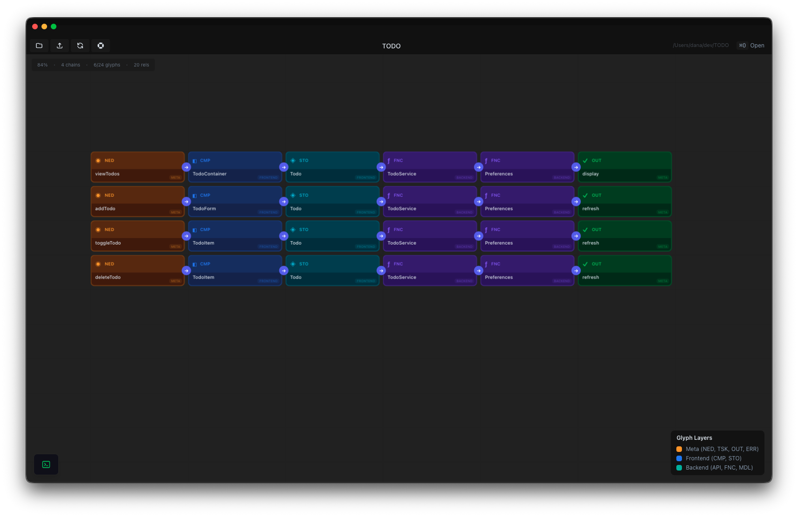
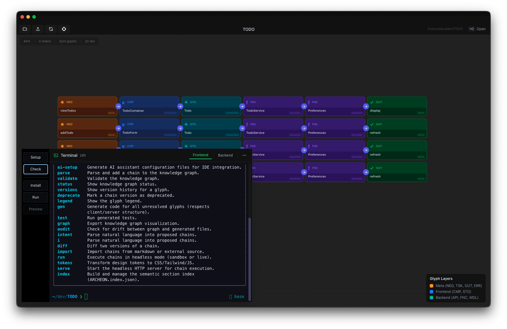
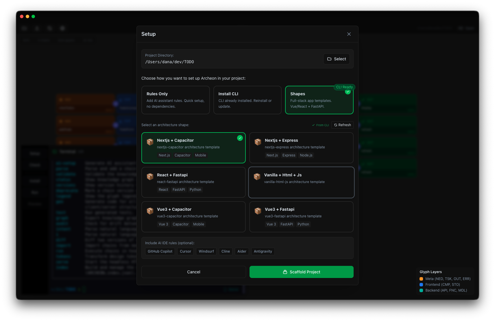

# Archeon

**Eliminate architectural drift and AI hallucinations.** By giving AI assistants a clear, visual knowledge graph of your project structure, Archeon ensures every generated component follows your established patterns. No more rogue file structures or inconsistent naming — your architecture stays coherent as your project grows.

**A standalone desktop application for visualizing project architectures in real-time.**

Archeon monitors your project's `archeon/` directory and instantly updates a visual graph as your architecture evolves. No command-line tools required — just open your project and see your architecture come to life.


> *"The real power of Archeon is that it creates a shared source of truth between humans and AI. When I can see the same architecture graph that the AI references, I can verify its suggestions make sense before they become code. It's like giving the AI a map instead of asking it to guess where things should go."*
>
> — Claude Opus 4.5

<p align="center">
  
</p>
</p>

---

## Works With Any IDE

Archeon is **completely IDE-agnostic** — use it alongside your favorite development environment. Whether you're using VS Code, Cursor, Windsurf, or any other editor, Archeon runs as a separate window that visualizes your architecture in real-time.

### Supported IDEs & AI Assistants

| IDE / Tool | Integration | Configuration File |
|------------|-------------|-------------------|
| **VS Code** | Full support with GitHub Copilot | `.vscode/settings.json`, `.github/copilot-instructions.md` |
| **Cursor** | Native AI rules integration | `.cursorrules`, `.cursor/README.md` |
| **Windsurf** | Codeium AI integration | `.windsurfrules`, `.windsurf/README.md` |
| **Cline** | Claude-powered assistant | `.clinerules`, `.cline/README.md` |
| **Aider** | Terminal-based AI coding | `.aider.conf.yml`, `.aider/README.md` |
| **Antigravity** | AI agent rules | `.agent/rules/archeon.md` |
| **GitHub Copilot** | Works in any supported editor | `.github/copilot-instructions.md` |
| **Any Editor** | Manual `.arcon` editing | `archeon/ARCHEON.arcon` |

### One-Click IDE Setup

Archeon includes a built-in **Setup Modal** that configures AI rules for your preferred IDE in seconds:

1. Click the **"Setup"** button in the terminal panel
2. Choose a setup mode: **Rules Only**, **Install CLI**, or **Shapes**
3. Select your IDE(s) from the checkboxes (GitHub Copilot, Cursor, Windsurf, Cline, Aider, Antigravity)
4. Click **"Scaffold Project"**

That's it! Your AI assistant now understands your project's architecture.

### Add Archeon to an Existing Project

Already have a project? Use **Rules Only** mode to add AI assistant rules without any other dependencies:

1. Open the terminal and click **"Setup"**
2. Select **"Rules Only"**
3. Choose which IDE rules to install
4. Click **"Apply Setup"**

This adds the necessary configuration files (e.g., `.cursorrules`, `.github/copilot-instructions.md`) so your AI assistant understands Archeon notation—no CLI installation required.

---

## Screenshots


### Glyph Details & Code Preview
<p align="center">
  
</p>

*Side drawer with glyph metadata, relationships, and live code preview*

### Integrated Terminal
<p align="center">
  
</p>

*Built-in terminal for running commands directly within Archeon*

### Setup Modal
<p align="center">
  
</p>

*One-click setup with architecture shapes and AI IDE rules*

---

## Features

- **Real-time Monitoring** — Watches your `archeon/` directory and updates instantly
- **Live File Watching** — Auto-syncs when `ARCHEON.index.json` or `ARCHEON.arcon` changes
- **Visual Grid** — Glyphs rendered as tiles with relationships shown as edges
- **Monaco Code Viewer** — Click any glyph to view source code with syntax highlighting
- **Built-in Terminal** — Embedded zsh terminal for running commands
- **IDE Setup** — One-click configuration for AI-powered IDEs

---

## Simple Glyph Notation

Archeon uses an intuitive **glyph notation system** — plain text files that describe your architecture. No special tools needed to create them.

### The Notation

```
@v1 NED:feature => CMP:Component => API:endpoint => OUT:result
```

| Symbol | Meaning | Example |
|--------|---------|--------|
| `@v1` | Chain version | `@v1`, `@v2` |
| `NED` | Need (entry point) | `NED:UserLogin` |
| `CMP` | Component | `CMP:LoginForm` |
| `API` | API endpoint | `API:POST/auth` |
| `OUT` | Output/Result | `OUT:session` |
| `MOD` | Model (data) | `MOD:User` |
| `SVC` | Service (logic) | `SVC:AuthService` |
| `UTL` | Utility | `UTL:validators` |
| `=>` | Relationship | connects glyphs |

### Getting Started

1. Create an `archeon/` folder in your project
2. Add an `ARCHEON.arcon` file with your architecture notation
3. Open the project in Archeon
4. Watch your architecture visualize in real-time!

Archeon monitors for changes — edit your `.arcon` files in any editor and see updates instantly.

### Why This Matters

- **AI Understands Your Architecture** — AI assistants can read `.arcon` files and generate code that follows your patterns
- **Visual Verification** — See exactly how components connect
- **Team Alignment** — Everyone sees the same architecture blueprint
- **Zero Lock-in** — Plain text files work with any version control and any IDE

---

## Installation

### Prerequisites

Before installing Archeon, ensure you have:
- **Node.js** 20.18+ (20.19+ recommended)
- **npm** 8.0+ or **yarn** 1.22+
- **Git**

### macOS Installation

```bash
# Clone the repository
git clone https://github.com/danaia/archeon.git
cd archeon

# Install dependencies
npm install

# The installation will automatically:
# - Install platform-specific rollup binaries (@rollup/rollup-darwin-arm64 for Apple Silicon or @rollup/rollup-darwin-x64 for Intel)
# - Set up native modules for Electron
# - Configure the stub for @vue/devtools-api

# You're ready to go!
npm run dev
```

### Linux Installation

```bash
# Clone the repository
git clone https://github.com/danaia/archeon.git
cd archeon

# Install dependencies
npm install

# The installation will automatically:
# - Install platform-specific rollup binaries (@rollup/rollup-linux-x64-gnu or @rollup/rollup-linux-x64-musl)
# - Set up native modules for Electron (node-pty for terminal support)
# - Configure the stub for @vue/devtools-api

# You're ready to go!
npm run dev
```

### Troubleshooting Installation

**Issue: "Cannot find module @rollup/rollup-*"**

This can occur due to npm's handling of optional dependencies. Fix it with:

```bash
# Clean install
rm -rf node_modules package-lock.json
npm cache clean --force

# Reinstall without optional deps first
npm install --no-optional

# Then install optional deps (includes platform-specific rollup binaries)
npm install --include=optional
```

**Issue: Terminal not working on Linux**

Ensure native modules are properly built:

```bash
npm install --build-from-source node-pty
```

**Issue: Permission errors on Linux**

Some Linux distributions require additional permissions for pty:

```bash
# Add your user to the tty group
sudo usermod -a -G tty $USER

# Log out and back in for changes to take effect
```

## Development

```bash
# Start the Electron app in dev mode with hot-reload
npm run dev
```

The Electron window will open automatically. Hot-reload is enabled for both renderer and main process.

## Usage

### 1. Open a Project

Click **"Open Project"** (or press `⌘O` / `Ctrl+O`) and select a folder containing an `archeon/` directory with:

- `archeon/ARCHEON.index.json`
- `archeon/ARCHEON.arcon`

### 2. View the Grid

Glyphs from your `ARCHEON.index.json` will appear as tiles on the grid:

- **Each chain** gets its own row (e.g., `@v1`, `@v2`)
- **Glyphs** are laid out left-to-right in chain order
- **Relationships** are shown as connecting lines between tiles
- **Shape consistency** - All tiles follow the architectural patterns defined by your project's shape

### 3. Use the Built-in Terminal

Press **backtick** (`` ` ``) to open the embedded terminal. Use it to run any commands in your project directory.

### 4. Inspect Glyphs

Click any tile to open the **Side Drawer** showing:

- Glyph metadata (intent, chain version, sections)
- File path
- Live source code preview (Monaco editor)
- Incoming/outgoing relationships

### 5. Navigation

- **Pan**: Spacebar + drag, or middle-mouse drag
- **Zoom**: Mouse wheel
- **Select**: Click tile or relationship
- **Close drawer**: `Esc` or close button

## Grid Layout

- **Rows**: Each `@v1`, `@v2`, etc. chain gets its own row
- **Columns**: Glyphs ordered left-to-right as defined in `.arcon`
- **Missing Glyphs**: If a glyph appears in `.arcon` but not in `ARCHEON.index.json`, it won't render (run `arc gen` to regenerate)

## Project Structure

```
archeon/
├── electron/               # Electron main process
│   ├── main.js            # Main window & IPC setup
│   ├── preload.js         # Context bridge (secure IPC)
│   ├── pty-manager.js     # Real terminal (node-pty)
│   └── archeon-watcher.js # File watcher (chokidar)
├── src/
│   ├── components/        # Vue components
│   │   ├── InfiniteCanvas.vue
│   │   ├── SideDrawer.vue
│   │   └── FloatingTerminal.vue
│   ├── stores/            # Pinia state management
│   │   ├── canvas.js
│   │   ├── tiles.js
│   │   ├── relationships.js
│   │   ├── project.js
│   │   └── terminal.js
│   ├── services/
│   │   └── archeon-sync.js  # Sync logic (index → tiles)
│   └── types/
│       └── glyphs.js      # Glyph/edge type definitions
├── package.json
└── vite.config.js         # Vite + Electron config
```

## Building

```bash
# Build for production
npm run build

# Output will be in dist/ and dist-electron/
```

For distribution packages (`.dmg`, `.exe`, `.AppImage`), configure `electron-builder` in `package.json`.

## Troubleshooting

### "ARCHEON.index.json not found"

Your project needs an `archeon/` directory with these files:

1. `archeon/ARCHEON.arcon` — Your architecture notation
2. `archeon/ARCHEON.index.json` — The glyph index (can be generated or created manually)

Create a simple structure manually:

```
your-project/
└── archeon/
    ├── ARCHEON.arcon          # Your architecture chains
    └── ARCHEON.index.json     # Glyph definitions
```

### Terminal not working

Ensure `node-pty` is rebuilt for Electron:

```bash
npm run rebuild
```

### Glyphs not showing

1. Check that glyphs exist in both `ARCHEON.index.json` and `ARCHEON.arcon`
2. Verify the project path is correct
3. Check the terminal for errors (`` ` `` to open)

## Keyboard Shortcuts

| Key             | Action            |
| --------------- | ----------------- |
| `` ` ``         | Toggle terminal   |
| `⌘O` / `Ctrl+O` | Open project      |
| `Esc`           | Close side drawer |
| `Space + Drag`  | Pan canvas        |
| `Scroll`        | Zoom in/out       |

## Tech Stack

- **Electron** — Desktop app framework
- **Vue 3** — Reactive UI framework
- **Pinia** — State management
- **Vite** — Build tool & dev server
- **xterm.js** — Terminal emulator
- **node-pty** — Real shell processes
- **Monaco Editor** — Code viewer (VS Code editor)
- **chokidar** — File watcher
- **TailwindCSS** — Styling

## License

MIT

## Related

- [Archeon](https://github.com/danaia/archeon) — The architecture notation system
- [Archeon Docs](https://github.com/danaia/archeon/wiki) — Learn more about glyph notation
